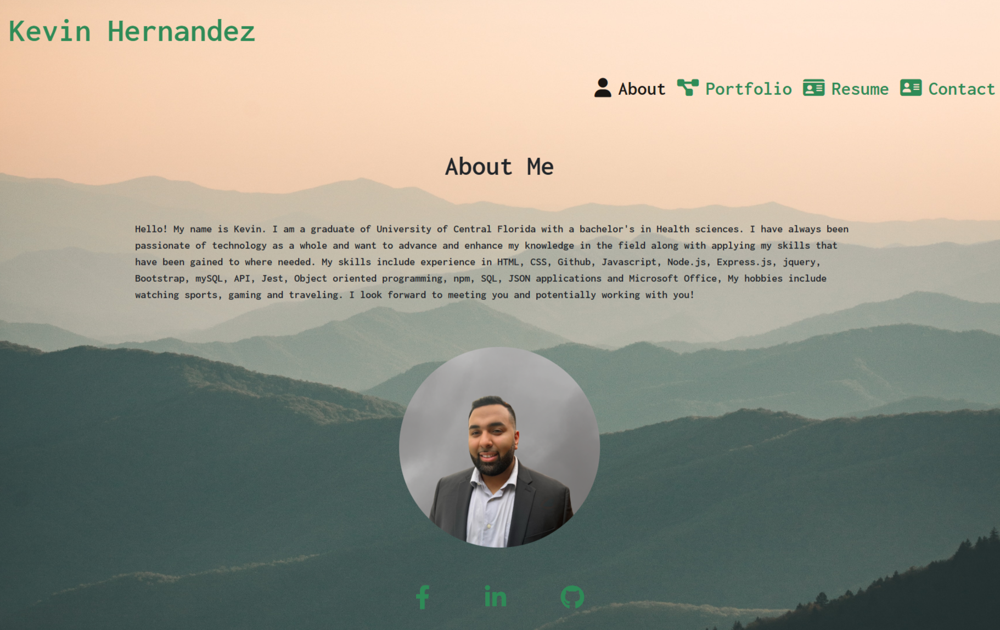

# React Portfolio

## Screenshot of Application

  ## Description
In this application, I have created a portfolio using react that will render a short biography, a portfolio, a resume and a contact form. The application renders the components accordingly using the nav bar and will show which tab is active. The application also responds to mobile phones and tablets.
  ## Installation
react app was created using npx create-react-app and used npm install to download all dependencies

  ## Links
  <a href="https://khernandez.netlify.app/#about">Link to Deployed application</a>
    <a href="https://github.com/khernandez0810/reactPortfolio">Link to github repo</a>
  
  ## Questions
 If you have any questions regarding this project, Please contact me at: 
  GitHub: https://github.com/khernandez0810@gmail.com  
  Email: khernandez0810@gmail.com
  ## Credits
  Kevin Hernandez